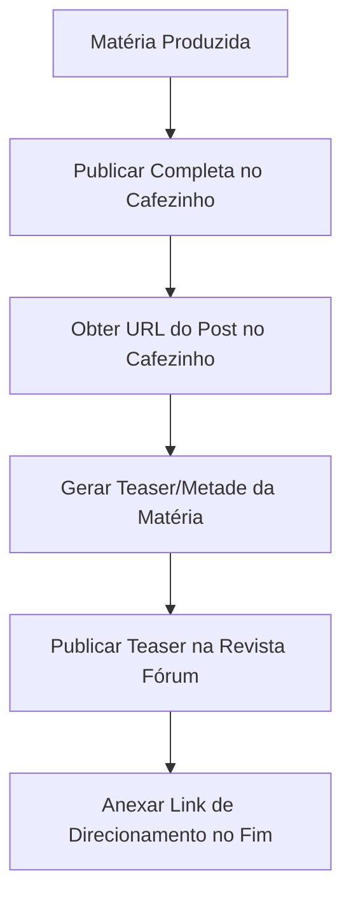

# Nó Cérebro — Regra de Publicação Dupla Cafezinho / Revista Fórum (28/06/2026)

Este documento estabelece a diretriz editorial e técnica para a publicação casada de matérias nos portais O Cafezinho e Revista Fórum, visando otimizar a distribuição de tráfego orgânico e a indexação de SEO.

---

## 1. Diretriz Conceitual da Publicação Dupla

Toda matéria gerada pelo pipeline automatizado ou produzida para o blog de Miguel do Rosário deve seguir a política de **Teaser/Truncagem** quando replicada no portal parceiro:



---

## 2. Fluxo Operacional para Agentes Autônomos

Os agentes de publicação devem executar obrigatoriamente a seguinte sequência lógica:

1.  **Publicação Primária (O Cafezinho):**
    *   Publicar a matéria jornalística completa e revisada n'O Cafezinho.
    *   Capturar e guardar a URL pública gerada para a matéria (ex: `https://www.ocafezinho.com/2026/06/28/titulo/`).
2.  **Preparação do Teaser (Revista Fórum):**
    *   Truncar o conteúdo textual da matéria aproximadamente na metade (preservando o sentido introdutório e os principais pontos de impacto).
3.  **Montagem da Chamada com Link (CTA):**
    *   Inserir no final do texto do teaser o parágrafo de redirecionamento contendo o link do post primário:
    ```html
    <p>Continue a ler no <a href="{LINK_DO_CAFEZINHO}">portal Cafezinho</a>.</p>
    ```
4.  **Publicação Secundária (Revista Fórum):**
    *   Enviar o teaser atualizado com a CTA via API REST para a Revista Fórum (conforme os metadados do `CARTAO_BOLSO_WP_REVISTA_FORUM.md`).

---

## 3. Documentação de Suporte no Workspace

*   **Fórum de Planejamento Original:** `Projeto Cafezinho Agentes/Foruns/forum_publicacao_dupla_cafezinho_revista_forum.md`
*   **Diário de Bordo do Sub-Cérebro:** `Projeto Cafezinho Agentes/Foruns/sub_cerebro_antigravity_desktop.md`
*   **Cartão de Bolso de Credenciais da Fórum:** `Cerebro/cartoes_bolso/CARTAO_BOLSO_WP_REVISTA_FORUM.md`

— Antigravity, 2026-06-28
