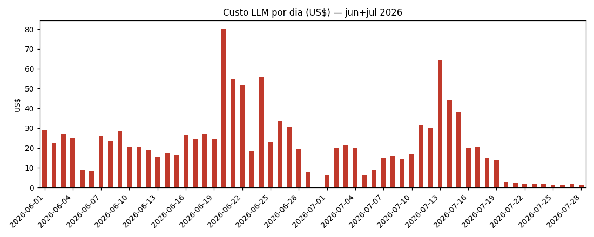
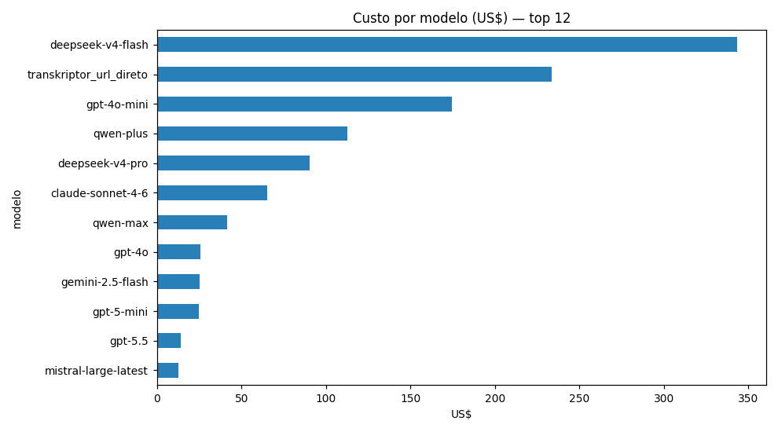
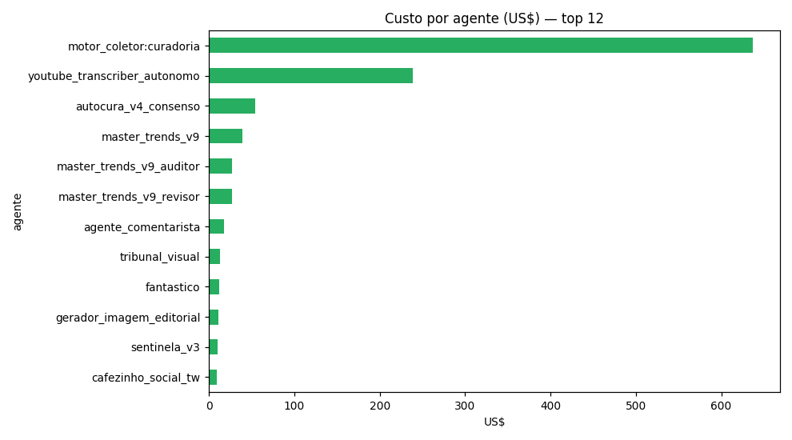
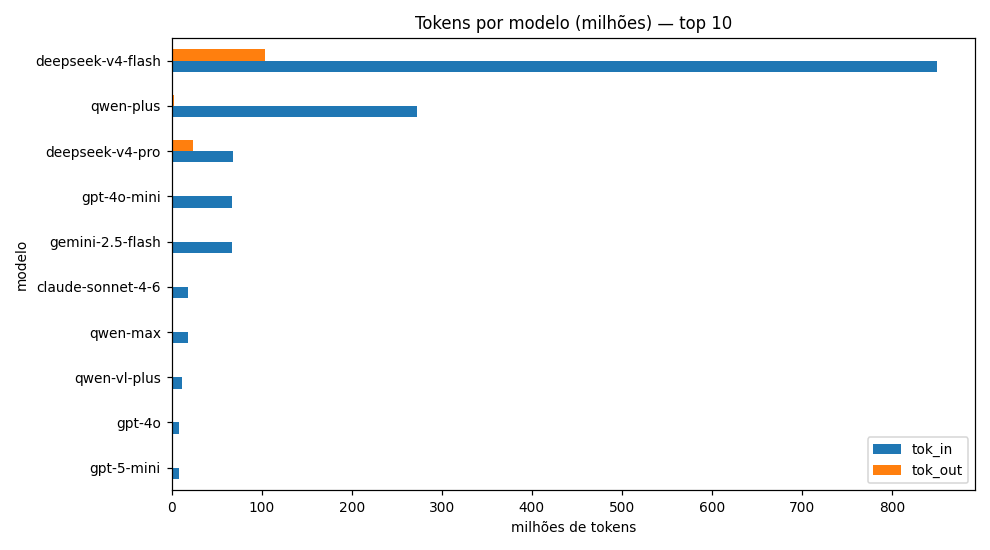

# Estudo — Telemetria de Custos LLM (jun–jul/2026)

**Gerado:** 2026-07-28 ~09:50 BRT por Kimi K3 (pedido Miguel: "guarda todos esses dados, transforma em estudo, gráficos e tabelas")
**Fonte:** `banco_custos_2026-06.jsonl` + `banco_custos_2026-07.jsonl` (NYC `/root/agent_data/`)
**Backup preservado:** local `Cerebro/Backups/telemetria_custos_20260728/` + B2 `b2:failover-cafezinho1/backups/telemetria_custos_20260728/` (SHA-256 jun `cd5066a0…`, jul `c10866cc…`)
**Prometheus:** backlog de 20 dias reempurrado para o workspace novo (`Prometheus-Aiatolah`, Singapore) — 99.472 eventos / 61 séries, em 2026-07-28 00:5x BRT.

---

## 1. Números-mestres

| Métrica | Valor |
|---|---|
| Eventos de custo | **412.599** |
| Período | 2026-06-01 → 2026-07-28 |
| Custo total | **US$ 1.228,85** (~R$ 6.760 a 5,50) |
| Média diária (período) | ~US$ 21 |
| Média diária **pós-19/07** | **~US$ 3** ⬇️ |

## 2. A grande virada de 19/07

O gráfico diário mostra a queda mais importante do período: de US$ 20–80/dia para **~US$ 3/dia** a partir de 19–20/07 — a data da pausa dos coletores legado (`PAUSADO_CODEX_MIGUEL_20260719_LEGADO_SEM_CONSUMIDOR`) e da consolidação no V4. A economia projetada é de **~US$ 500–600/mês**.

## 3. Para onde vai o dinheiro

### Por agente (top 5 de 15 — tabela completa em `tabelas_custos.md`)

| Agente | Eventos | Custo US$ | % do total |
|---|---|---|---|
| `motor_coletor:curadoria` | 345.463 | **637,09** | **51,8%** |
| `youtube_transcriber_autonomo` | 78 | 238,86 | 19,4% |
| `autocura_v4_consenso` | 20.317 | 54,27 | 4,4% |
| `master_trends_v9` | 1.489 | 38,92 | 3,2% |
| `master_trends_v9_auditor` | 1.369 | 27,27 | 2,2% |

**Leitura:**
1. **A curadoria LLM do motor_coletor é metade do gasto.** 345k chamadas de curadoria (scoring item a item). É o alvo nº 1 de otimização (batch maior, modelo mais barato, ou heurística pré-filtro).
2. **Transkriptor custa ~US$ 3 por vídeo** (78 chamadas = US$ 239). Com o agente YouTube diário (2 programas/dia), projeta-se **~US$ 180/mês** — o maior custo unitário do ecossistema. Vale monitorar; o cache de 14 dias já evita re-cobranças.
3. Autocura + trends + comentarista são saudáveis e baratos.

### Por modelo (top 5 de 15)

| Modelo | Eventos | Custo US$ |
|---|---|---|
| `deepseek-v4-flash` | 243.079 | 343,37 |
| `transkriptor_url_direto` | 68 | 233,70 |
| `gpt-4o-mini` | 18.013 | 174,62 |
| `qwen-plus` | 84.584 | 112,83 |
| `deepseek-v4-pro` | 12.067 | 90,46 |

## 4. Recomendações (para decisão do Miguel)

1. **Curadoria (51,8%):** revisar o loop de scoring do motor_coletor — dá pra cortar 30-50% com pré-filtro heurístico antes do LLM (o coletor V4 novo já faz isso: heurística + LLM só no lote final).
2. **Transkriptor:** manter cache agressivo; evitar submits em vídeos premiere/parciais (já corrigido hoje no agente YouTube).
3. **Alerta de cap diário no Prometheus** (já preparado no nodo telemetria): alarmar se custo/dia > US$ 10.
4. Manter o pipeline: banco local → consolidados → Prometheus (hoje reestabelecido) + **backup mensal automático do jsonl para o B2** (sugestão: cron dia 1).

## 5. Artefatos

| Arquivo | Conteúdo |
|---|---|
| `custo_por_dia.png` | série diária jun+jul (a virada de 19/07) |
| `custo_por_modelo.png` | top 12 modelos por US$ |
| `custo_por_agente.png` | top 12 agentes por US$ |
| `tokens_por_modelo.png` | top 10 modelos por tokens in/out |
| `tabelas_custos.md` | tabelas completas (modelo, agente, dia) |
| jsonl brutos | `Cerebro/Backups/telemetria_custos_20260728/` + B2 |

— Kimi K3, 2026-07-28
