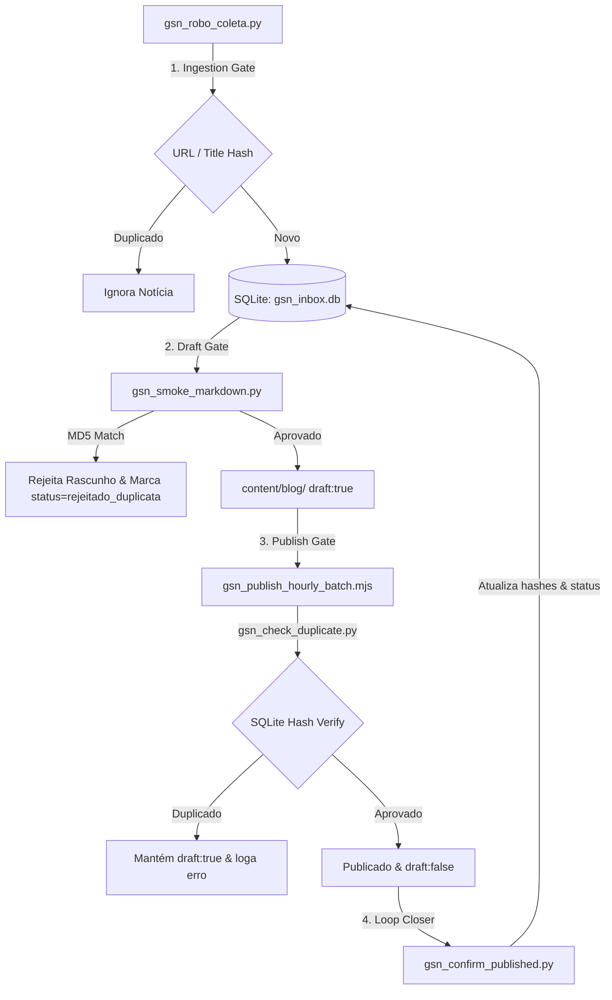

# FÓRUM GSN: ESTABILIZAÇÃO E IDEMPOTÊNCIA DE CONTEÚDO (JULHO 2026)
*Prevenção de Loops de Re-ingestão e Duplicidade de Matérias/Ilustrações*

---

## 🎯 1. DIAGNÓSTICO DO PROBLEMA
Anteriormente, o pipeline do **Global South News (GSN)** sofria com re-ingestão cíclica de conteúdos e duplicações de imagens/matérias (comportamento de "loop"). Isso ocorria porque:
1. As verificações de duplicidade dependiam principalmente de similaridade de Jaccard e detecções heurísticas voláteis, sem persistência entre as execuções dos cron jobs.
2. O banco de dados SQLite (`gsn_inbox.db`) não continha identificadores únicos confiáveis além da URL bruta. Se a mesma pauta fosse coletada de uma URL ligeiramente diferente ou com pequenas variações de texto, ela furava o bloqueio.
3. Não havia integração rígida de estado ("Source of Truth") entre os coletores, o gerador de rascunhos Markdown e o script de publicação horária em Astro/Node.

---

## 🏛️ 2. A ARQUITETURA DA SOLUÇÃO (TRAVAS DE IDEMPOTÊNCIA)
Para blindar o ecossistema GSN contra repetições, implementamos um sistema de **idempotência de triplo estágio baseado em hashes MD5**:

### Detalhes dos Componentes:
1. **Silo Central de Identificação (`gsn_inbox.py`)**:
   - Introdução das colunas `title_hash` (normalizado, sem acentos, minúsculo) e `content_hash` (baseado nos primeiros 500 caracteres limpos do corpo).
   - Migração dinâmica e segura das tabelas sem perda de dados na conexão SQLite.
2. **Barreira de Ingestão (`gsn_robo_coleta.py`)**:
   - A função `eh_duplicata_no_banco` atua antes mesmo do parse, rejeitando matérias cujos hashes ou URLs já existam no SQLite com status de processado.
3. **Barreira de Geração de Markdown (`gsn_smoke_markdown.py`)**:
   - Durante a compilação local dos rascunhos, verifica o banco contra duplicatas do título original e também do título refinado gerado pela IA.
   - Marca as notícias puladas com o status específico no banco (`rejeitado_duplicata`), evitando re-processamentos inúteis.
4. **Validador de Publicação Horária (`gsn_publish_hourly_batch.mjs`)**:
   - Executa a ferramenta de verificação `gsn_check_duplicate.py` antes do consenso dos auditores externos. Se for identificada duplicidade na base SQLite, a publicação é barrada, rebaixando a pauta para rascunho de forma segura.
5. **Fechamento do Loop (`gsn_confirm_published.py`)**:
   - Ao confirmar um commit publicado na CDN, gera os hashes autoritativos e marca o registro correspondente como `processado_v9=1` e status `publicado_markdown`.

---

## 📂 3. ARQUIVOS E DIRETÓRIOS ENVOLVIDOS

### 🛠️ Código e Scripts do Pipeline
*   **Central de Hashing e SQLite**: `root/gsn_inbox.py`
*   **Robô de Coleta**: `root/gsn_robo_coleta.py`
*   **Gerador de Rascunhos Markdown**: `root/gsn_smoke_markdown.py`
*   **Confirmador de Publicações**: `root/gsn_confirm_published.py`
*   **Script de Publicação em Lote (Node.js)**: `gsn/scripts/gsn_publish_hourly_batch.mjs`
*   **Novo Script Auxiliar de Verificação**: `root/gsn_check_duplicate.py`

### 🔑 Localização de Credenciais e Dados
*   **Arquivo de Variáveis de Ambiente**: `/home/migueldorosario/Downloads/Antigravity Google/Global South News/root/chaves_gsn.env`
*   **Banco de Dados SQLite**: `/home/migueldorosario/Downloads/Antigravity Google/Global South News/root/agent_data/gsn_inbox.db`
*   **Fila de Publicação Estática**: `/home/migueldorosario/Downloads/Antigravity Google/Global South News/gsn/tools/gsn_hourly_queue.json`

---

## 📜 4. DIRETRIZES DE COMPLIANCE JORNALÍSTICA
Para manter o **Padrão Ouro V10**, os agentes devem respeitar estritamente a "Constituição Editorial":
*   **Regra de Ouro do Parágrafo**: Exatamente 2 sentenças por parágrafo no corpo da matéria.
*   **Sem Listas**: Proibição total de bullets ou enumerações estruturadas.
*   **Rigor Temporal**: Uso exclusivo de datas absolutas. Donald Trump deve ser tratado como presidente em exercício, e fatos com mais de 48 horas como background histórico.
*   **Língua Oficial**: Todo o conteúdo final gerado no diretório Astro deve ser em **Inglês**.
