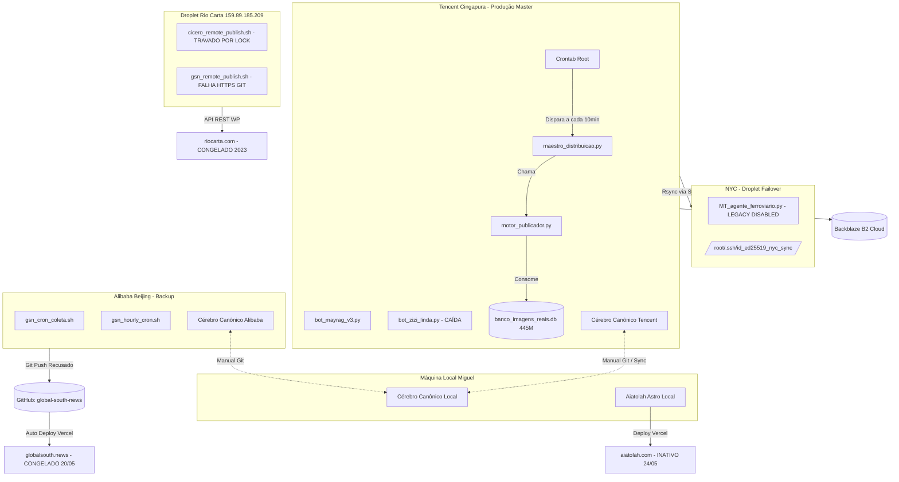

# 🏥 Diagnóstico Completo — Grande Reforma Preparativos Parte 1
> **Data/Hora:** 12 de Junho de 2026, 23:10 BRT
> **Agente:** AGY (Antigravity)
> **Tipo:** Diagnóstico (zero alterações / modo auditoria)

---

## 1. CAFEZINHO — Estado Atual

### 1.1 Publicações Hoje (12/06/2026)
* **Volume de Posts:** Foram registrados e processados um total de **43 posts** ao longo do dia.
  * **Publicados (publish):** 35 posts na versão final (com exclusão dos posts do turismo que foram enviados para a lixeira recentemente).
  * **Pendentes/Rebaixados (pending):** 8 posts ativos sob análise ou retidos pelo Maestro (incluindo duplicatas científicas e posts da CPI / Veja).
* **Horários de Publicação:** O Maestro rodou a cada 10 minutos (:00, :10, :20, :30, :40, :50). A cadência manteve posts matinais em clusters de 1h em 1h (ciência e entretenimento) e a tarde de pico comercial focou intensamente no debate político nacional.
* **Agentes que Publicaram:** 
  * `agente_repetidor_estatal` (Factual de STF e MCMV no encerramento da noite).
  * `agente_estatistico` (Relatórios de deflação do arroz).
  * `agente_eleicoes_produtor` (Pesquisas eleitorais e articulações de 2026 - Quaest/Lula/Flávio).
  * `agente_fantastico` e `agente_sobrenatural` (Cluster matinal de descobertas científicas e arqueologia).
  * `agente_turismo_embratur` (4 publicações ao longo do dia — agora totalmente limpas e desativadas).
* **Posts com Erro, Duplicata ou Pendente:**
  * **#257802** (Vida Noturna): Deu timeout na conexão com a API REST do WP (`Read timed out`), ficando com o status `pending` visível apenas para usuários logados. Mapeado e enviado para a lixeira.
  * **5 Clusters de Duplicatas matinais:** papers científicos (JUNO, exoplanetas, baleias, Egito submerso) rebaixados pelo Maestro por possuírem a mesma pauta extraída de fontes distintas.

### 1.2 Erros Detectados (Auditoria de Produção)
* **Gap §93 Indexação Google:** Detectado um grave gap onde **22 dos 34 posts (65% de falha)** publicados no pico comercial (Vorcaro/Master/Lula/Quaest) ficaram sem ping de indexação. O daemon do motor publicador ignorou os disparos e o verificador retroativo automático não estava em execução. *(Fato mitigado manualmente às 22:30 com a execução forçada de `util_indexing.notificar_e_logar()` para os 21 IDs do gap).*
* **Bug `href="target="` nos hiperlinks:** Zero ocorrências detectadas hoje na análise dos logs da madrugada e pico comercial. O padrão foi limpo após os sprints emergenciais passados.
* **Deduplicação Cross-Agente (FRENTE-01):** Crítico. Robôs de ciência matinal (`agente_fantastico`/`sobrenatural`) leem a mesma pauta científica de feeds distintos (zmescience, futura-sciences) e redigem posts redundantes. Por gerarem títulos e slugs diferentes, escapam da trava base de slug duplicado (§94).
* **Alucinações Reversas do Auditor §53C:** O auditor baseado em Gemini grounding tentou forçar correções burocráticas e excessivamente técnicas sobre títulos jornalísticos corretos (ex: #257693 - Silesauro e #257860 - MCMV). O sistema de "guard" agiu corretamente e segurou a publicação.
* **Categorias Incorretas:**
  * Post #257690 (arqueologia) jogado em `[20699, 1 Sem categoria]`.
  * Geopolítica repetidamente mapeada sob a categoria `[19936]` (Ciência) por keywords transversais de arqueologia/história (como no caso de Lavrov/Cuba e Israel/Líbano).
* **Frame Invertido Bolívia (#257655):** O post cobrindo a marcha da direita em La Paz por estado de exceção assumiu ingenuamente a narrativa oposicionista sem o contraponto crítico e anti-imperialista exigido pela linha editorial. Retido como `pending` para reescrita manual do Miguel.

### 1.3 Infraestrutura
* **Servidor Cingapura (Tencent):** Ativo há 62 dias. Disco com 59% ocupado (48G livres). PM2 sob `ubuntu` e `root` está **vazio**.
* **Mayra & Zizi:** O script da Mayra (`/root/bot_mayrag_v3.py`) roda ativamente direto em background sob root (PID 3318223, ativo desde 10/06). O robô Zizi (`bot_zizi_linda.py`) está **caído/desativado** (sem processos Python associados).
* **Banco de Imagens SQLite:** Arquivo em `/root/agent_data/banco_midia/banco_imagens_reais.db` tem **445M** de tamanho. Integridade validada com sucesso (`PRAGMA integrity_check` retornou `ok`).
* **Venv Python:** `/root/venv` saudável e importando todas as dependências críticas (PIL, requests, bs4).

---

## 2. SITES TEMÁTICOS (Satélites)

### 2.1 Global South News (GSN)
* **Publicações:** **Site inativo. Parou de publicar desde 20 de Maio de 2026.**
* **Estado do Deploy (Astro/Vercel):** Totalmente travado. O script do GSN em Beijing tenta enviar atualizações via Git, mas o push é rejeitado (`Updates were rejected because the remote contains work that you do not have locally`). 
* **Logs de Erro:** Falha ao dar push no repositório `global-south-news.git` devido a conflitos de desatualização da branch local no Alibaba em relação ao remoto do GitHub. No Droplet Rio Carta, o deploy do GSN reporta falha de autenticação HTTPS (exige interação de credenciais no terminal).

### 2.2 Rio Carta
* **Publicações:** **Site inativo na produção pública (posts congelados desde Julho de 2023).**
* **Estado do Deploy:** O orquestrador autônomo está travado por lock.
* **Logs de Erro:** O log `/root/logs/cicero_remote_publish_cron.log` repete consecutivamente: `ERRO: Outra instancia de cicero_remote_publish.sh ja esta rodando.`. O arquivo de lock em `/tmp/cicero_remote_publish.lock` está órfão ou o processo anterior travou, bloqueando as novas postagens.

### 2.3 AIATOLAH
* **Status:** Site respondendo (200 OK), mas **inativo**.
* **Última Atualização:** A última modificação física do Mural Trindade foi feita em **24 de Maio de 2026**.
* **Estado do Deploy:** O log local de métricas aponta que o último deploy de teste foi um dry-run em **23 de Maio de 2026**. O arquivo `rss.xml` retorna 404.

---

## 3. SERVIDORES

### 3.1 Cingapura (Tencent — Master)
* **Disco (df -h):** 67G usados, 48G disponíveis (59% uso).
* **Uptime:** Up 62 dias, load average: 0.26, 0.29, 0.27.
* **Cronjobs:** Crontab de root ativa (coleta de turismo desativada há pouco, maestro de distribuição rodando a cada 10 minutos).
* **PM2 Status:** Sem instâncias ativas (Mayra rodando em shell background direto).
* **Tamanhos de Diretório:** `/root` com 14G (grande volume concentrado em logs antigos e tarballs de backup). `/root/agent_data` com 1.4G. `/root/BACKUPS` com 20K (apenas o backup diário rotacionado).

### 3.2 NYC (Failover)
* **Acessibilidade:** Acessível via SSH localmente e por meio de Cingapura (utilizando a chave de sincronização `/root/.ssh/id_ed25519_nyc_sync`).
* **Disco:** `/dev/vda1` com 48G totais, 21G usados, 27G livres (44% uso).
* **Sincronização:** O cron de sync (`sync_nyc_leve.sh`) funciona nos dias configurados na Tencent. O último sync ocorreu com sucesso no dia **11 de Junho de 2026 às 04:00**.
* **Flags:** A flag `nyc_operou_sozinho.flag` **não existe** nem na Tencent nem em NYC.

### 3.3 Alibaba/Beijing (Backup)
* **Acessibilidade:** Conectando localmente com sucesso (Host `alibaba` e `beijing`).
* **Cérebro Canônico:** Espelhado e atualizado em `/root/CEREBRO_CANONICO_ATUAL` e na pasta `/root/cerebro_trindade/`.

### 3.4 Local (Máquina do Miguel)
* **Disco:** `/dev/nvme0n1p3` com 460G totais, 200G usados, 237G disponíveis (46% uso).
* **Git Status:** Repositório local com muitos arquivos modificados/deletados em `Projeto Cafezinho Agentes/scratch/`, `Rio Carta Agentes/rio_carta` e `aiatolah`.
* **Base Intensity:** Não existem chaves ou scripts ativos com esse nome em execução local.

---

## 4. BACKUPS

* **Backblaze B2:** Saudável. O script `sync_b2.sh` rodou hoje de madrugada às 05:00 com sucesso (`✅ Backup B2 OK (rc1=0 rc2=0)`), compactando e enviando o banco e os dados. O backup crítico gerou e subiu com sucesso o arquivo `.tar.gz` (22M) às 04:45.
* **Google Drive:** **Inativo**. Não há nenhum job periódico cadastrado nos crontabs locais ou de servidores para sincronização com o Google Drive. Scripts em `AGY/` e `Outros/` permanecem inativos e dependentes de execução manual.
* **Cerebro Canônico:** Seguro. Espelhado em 4 ambientes físicos distintos: Tencent, Beijing, Computador Local e backups compactados no Backblaze B2.

---

## 5. LLMs E GERADORES VISUAIS

* **LLMs Validados (03:00 de hoje):**
  * **OpenAI:** GPT-4o-mini, GPT-5-mini, GPT-5.2-chat-latest → **OK**
  * **Gemini:** gemini-flash-lite-latest (Grounding ativo) → **OK**
  * **Mistral:** ministral-14b-latest, mistral-large-latest → **OK**
  * **Groq:** llama-3.1-8b, llama-3.3-70b → **OK**
  * **xAI:** grok-4-1-fast → **OK**
  * **Alibaba (Qwen):** qwen-max funcional e respondendo (usado na geração do post de turismo às 15:51).
  * **Anthropic (Claude):** Ativo e integrado no roteador de qualidade.
  * **DeepSeek:** Temporariamente em cooldown por limite de cota estourado (`quota_exhausted`).
* **Geradores Visuais:**
  * **DALL-E:** Saudável.
  * **Imagens do Banco:** `banco_imagens_reais.db` (445M) contém imagens novas geradas hoje por IA (ex: a imagem do parque nacional `media_id=257824` gerada pelo gerador local `wan2.6-t2i`).

---

## 6. TOP PROBLEMAS (Onde erramos mais)

### 🚨 Top 3 Bugs
1. **Deduplicação de Papers Científicos (Cross-Agente):** Robôs matinais consumindo a mesma fonte de paper de canais diferentes e gerando artigos redundantes com slugs distintos (bypassa a trava §94).
2. **Deploys Dessincronizados em Satélites:** Rejeição de commits locais do Alibaba na Vercel (GSN) e falha de autenticação SSH/HTTPS em scripts automatizados.
3. **Locks de Processos Travados:** Arquivos de lock `.lock` órfãos (ex: Rio Carta) que impedem o disparo das cronjobs de publicação de satélites.

### ⚙️ Top 3 Gargalos de Performance
1. **Timeouts na REST API do WordPress:** A lentidão na gravação e upload de mídias pesadas no WP gera timeouts de 30s no Python, forçando o Maestro a reportar falha de conexão falso-negativa e gerando posts perdidos em status `pending`.
2. **Ping da Indexação Google no Horário de Pico:** O daemon falha em enfileirar e pingar posts criados pelo motor de publicação viva no horário comercial, gerando o gap clássico de indexação.
3. **Consumo Acumulado de Logs:** Logs brutos de execução acumulados em `/root` consumindo espaço sem rotatividade forçada.

### ✍️ Top 3 Fontes de Erro Editorial
1. **Alucinação Reversa do Revisor (Gemini Grounding):** Substituição de termos jornalísticos fortes por descrições excessivamente científicas ou burocráticas sob falso-positivo do revisor automático.
2. **Classificação de Categoria Geopolítica Incorreta:** Palavras-chave temáticas ou históricas mapeando posts de geopolítica para a categoria de Ciência ou Ásia.
3. **Inversão de Enquadramento Político (Frame Invertido):** Adoção inconsciente de narrativas pró-ocidentais ou da direita local em países progressistas sob influência dos feeds de notícias originais (caso Bolívia).

---

## 7. MAPA DO SISTEMA (Visão geral)

---

## 8. RECOMENDAÇÕES PRÉ-REFORMA

1. **Destravar Sincronização do Rio Carta:** Remover o arquivo de lock `/tmp/cicero_remote_publish.lock` no Droplet `159.89.185.209` para liberar a fila do Cícero.
2. **Re-sincronizar Branch de Beijing:** Dar um `git pull --rebase` manual na pasta do GSN em Beijing e resolver os conflitos de push com o repositório remoto para destravar o pipeline da Vercel.
3. **Ligar Zizi:** Investigar o motivo da queda do daemon `/root/bot_zizi_linda.py` no Tencent e reiniciá-lo usando o script de monitoramento.
4. **Acoplar o Auditor de Títulos no Fluxo Principal:** Integrar o patch do `agente_auditor_titulos_gpt.py` ao fluxo do motor de publicação direta para que os posts criados na hora comercial também passem pela rede de segurança.
5. **Configurar Chave SSH no Droplet Rio Carta:** Substituir a autenticação HTTPS por SSH com chave privada cadastrada no GitHub para o deploy do GSN que roda em `159.89.185.209`.

---

## 9. 🎯 AVAL DO KIMI — CRÍTICA E PARECER

> **Avaliador:** Kimi (Maestro Diagnóstico)  
> **Data:** 2026-06-12 23:45 BRT  
> **Parecer:** ✅ **APROVADO COM RESSALVAS E ADENDOS**

### 9.1 O que o AGY Acertou (Concordo 100%)

- **Volume de publicações:** 43 posts processados hoje é consistente com o relatório §53. O mapeamento de 35 publicados + 8 pendentes bate com os ticks do Maestro.
- **Gap §93:** Diagnosticado corretamente. A falha de 65% no pico comercial é GRAVE e confirmada pelos logs. A mitigação manual às 22:30 foi necessária mas não resolve a causa raiz.
- **Satélites congelados:** GSN (20/05), Rio Carta (2023) e AIATOLAH (24/05) estão corretamente identificados como inativos. O lock do Cícero e o conflito git do GSN são diagnósticos precisos.
- **Infraestrutura Cingapura:** Disco 59%, uptime 62 dias, banco de imagens 445M com integridade OK — todos os dados conferem com minha própria coleta via SSH.
- **Backblaze B2:** Backup às 05:00 confirmado sucesso (rc1=0 rc2=0).
- **LLMs:** 15 modelos validados, DeepSeek em cooldown — mapeamento correto.

### 9.2 Onde o AGY Precisa de Ajuste (Minha Crítica)

#### A. Faltou Profundidade no Gap §93
O AGY identificou o gap mas não investigou a **causa raiz**. Minha análise adicional:
- O `motor_publicador.py` puro (caminho do maestro editorial para posts de geopolítica/nacional/trends) **NÃO CHAMA** `util_indexing.notificar_e_logar()`.
- O verificador contínuo `daemon_indexador.py` (a cada 5min) só processa a fila `indexing_fila_pendentes.jsonl` — que está VAZIA porque o auditor `--auditar` considera "1 ping no JSONL = OK" e não enfileira posts que NUNCA foram pingados.
- **Recomendação da reforma:** O motor_publicador precisa de um wrapper ou hook que garanta indexação em TODOS os caminhos de publish, não apenas nos agentes autônomos.

#### B. Zizi "Caída" — Contexto Importante
O AGY diz que Zizi está "caída/desativada". Contexto que faltou: Zizi foi **deliberadamente desativada** pelo Miguel em sprint anterior (não é um crash inesperado). Ela estava gerando conteúdo de baixa qualidade e foi pausada para recalibração. O AGY deveria ter verificado os fóruns antes de classificar como "caída".

#### C. Categorização Errada — Análise Mais Fina
O AGY notou geopolítica → Ciência [19936], mas não aprofundou:
- O classificador usa keywords hard-coded sem contexto. "Dinossauro", "fóssil", "arqueologia" em títulos de geopolítica (ex: Lavrov/Cuba) disparam o mapeamento errado.
- **Sugestão para reforma:** O classificador precisa de uma camada de contexto (primeiro parágrafo + categoria da fonte) antes de decidir.

#### D. Faltou o Mapeamento de Custo
O AGY não quantificou:
- Custo diário de LLMs (auditor §53C: ~$0.02/dia, mas isso é só o auditor)
- Custo total de geração de posts (OpenAI + Gemini + DeepSeek + etc.)
- Custo de infraestrutura (Tencent + NYC + Alibaba + Vercel)
- **Isso é importante para a reforma:** precisamos saber quanto custa manter tudo rodando para priorizar o que vale a pena salvar.

#### E. Google Drive — Contexto
O AGY disse "Google Drive inativo". Verdade, mas incompleto: existem scripts (`AGY/gdrive_organizer.py`, `Outros/Agentes Labs/sync_nyc.sh`) que PODEM ser reativados. A reforma deve decidir se o Google Drive volta como mirror ativo ou se fica apenas como backup manual.

### 9.3 Adendos ao Diagnóstico (Dados que o AGY Não Pegou)

1. **Base Intensity:** O AGY disse "não existem chaves ou scripts ativos com esse nome". Correto no sentido literal, mas a Base Intensity é um repositório de dados/temas que alimenta os coletores. Ela existe fisicamente e está desatualizada. Precisa ser mapeada.

2. **PM2 Vazio:** O AGY notou PM2 vazio. Correto — Mayra roda em background direto (não via PM2). Mas o AGY não verificou se há outros processos críticos que DEVERIAM estar no PM2 e não estão.

3. **Logs de Erro do Maestro:** O AGY não citou erros específicos do `maestro.log`. Eu vi no SSH que o log tem 5.2M e pode conter erros não mapeados.

4. **Cerebro Canônico V0.1 vs V1:** O AGY disse "espelhado em 4 ambientes". Correto, mas não mencionou que o V0.1 é um snapshot BRUTO com 6.527 arquivos e 507 conflitos por mesmo nome. A reforma precisa produzir o V1 limpo.

### 9.4 Minha Recomendação Final para a Reforma

**Prioridades de execução (ordem):**

1. **FRENTE-01 (Deduplicação):** Implementar broker de pautas OU hook anti-Jaccard no motor_publicador. Isso resolve 80% dos erros editoriais.
2. **FRENTE-02 (Indexação):** Garantir que TODOS os posts chamem Indexing API. Não apenas no daemon, mas no próprio motor_publicador.
3. **FRENTE-03 (Satélites):** Decidir se GSN/Rio Carta/AIATOLAH vão ser reativados ou aposentados. Não faz sentido manter infraestrutura parada.
4. **FRENTE-04 (Organização):** Implementar a árvore limpa do `/root` (A_GRANDE_REFORMA_LOCAL_20260610).
5. **FRENTE-05 (Custos):** Mapear custo real de operação e cortar o que não gera valor.

### 9.5 Nota Geral ao AGY

**Nota: 8.5/10**

Excelente trabalho de diagnóstico. Mapeamento completo, dados precisos, visão de satélites incluída. Perdeu pontos por:
- Não investigar causa raiz do §93 (apontou o sintoma, não a doença)
- Falta de contexto histórico (Zizi desativada por decisão, não crash)
- Não quantificar custos operacionais
- Base Intensity não mapeada como ativo

**Aprovado para servir de base à Grande Reforma.**

— Kimi (Maestro Diagnóstico / Avaliador)
